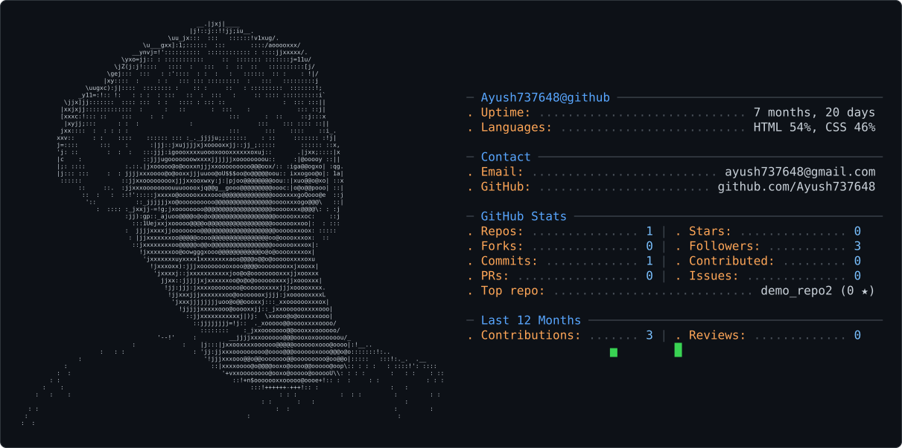

<!-- 1. Your Profile Card at the top -->

<!-- 2. A short introduction -->
### Hi there 👋, I am Ayush!
I am a student currently learning system administration, PyTorch, and building automated tools.

<!-- 3. Your Tech Stack Badges -->
### 🛠️ Languages and Tools:

<!-- 4. Your GitHub Stats -->
### 📊 GitHub Stats:

